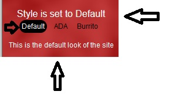

# CSS switcher
This php script will let you switch between css sheets throughout your site until another is clicked. 
You can edit this as you like, you will have to change names and css files to your liking.  
This uses a session to contnue the css style throughout the site.  
 
This is the output which is in the html php.text file that you will need to add to your site on a php page.
